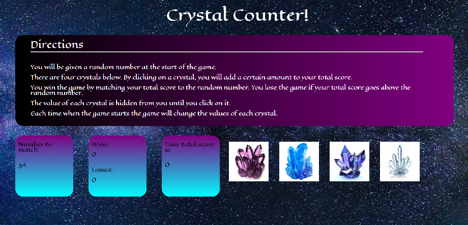

# CrystalCounter:

In this interactive game, four different crystals are displayed, each with a randomly-generated number value. The player must click on the crystals to generate the correct score and match the provided number at the beginning of the game. 

## Developer's Toolkit:
html, CSS, JavaScript

## Live Link: 
https://jivinjules.github.io/CrystalCounter

## Website Screenshot:

